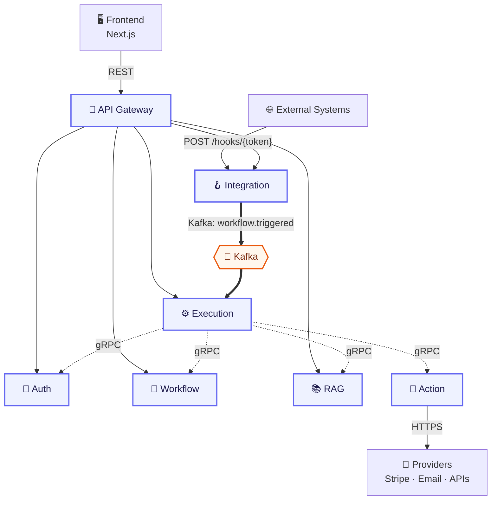
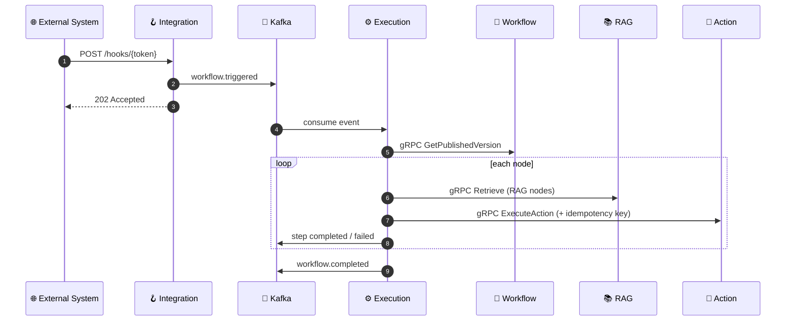
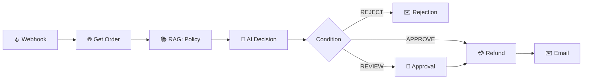
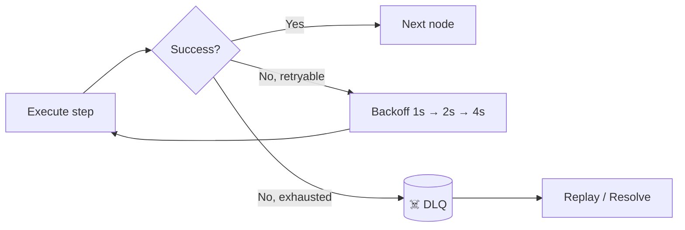

<div align="center">


### Intelligent Workflow Automation Platform

**Event → Understand → Retrieve Knowledge → Decide → Validate → Act → Observe → Recover**

<br/>

[](https://www.python.org/)
[](https://fastapi.tiangolo.com/)
[](https://www.postgresql.org/)
[](https://kafka.apache.org/)
[](https://grpc.io/)
[](https://www.docker.com/)
[](https://nextjs.org/)

</div>

---

## 🚀 What is Relay?

Relay is a **multi-tenant workflow automation platform** for processes that are too complex for a simple `Event → Action` rule. A company builds a workflow once in a visual editor, publishes it, and Relay runs it whenever the trigger fires — pulling data from APIs, retrieving company knowledge with **RAG**, making **structured AI decisions**, asking for **human approval**, and **recovering** when something fails .. .

> Relay never moves money itself. It calls the payment provider's API; the provider performs the refund.

## ✨ Key Features

| | |
|---|---|
| 🎨 **Visual workflow builder** | Drag-and-drop nodes, data mapping with `{{variables}}`, test & publish |
| 🪝 **Dynamic webhooks** | Per-workflow endpoint, secret auth, instant `202 Accepted` |
| 📚 **RAG knowledge base** | Upload docs → chunk → embed → pgvector search, tenant-scoped |
| 🤖 **Controlled AI decisions** | Strict output schema + Pydantic validation before any action runs |
| 🙋 **Human approval** | Pause, wait for a decision, resume |
| 🛡️ **Reliability** | Retries with backoff, idempotency keys, dead-letter queue, replay |
| 🔍 **Observability** | Step-level execution history and audit logs |
| 🔒 **Security** | Argon2id, JWT, RBAC, workspace isolation, credentials never exposed |

## 🏗️ Architecture

True microservices, each owning its own database. Three communication layers: **REST** (external), **gRPC** (internal sync), **Kafka** (async events).



| Service | Owns | Responsibility |
|---|---|---|
| 🚪 API Gateway | — | Routing, auth context, rate limiting |
| 🔐 Auth | users, workspaces | Identity & permissions |
| 🧩 Workflow | workflows, versions, nodes, edges | Definitions, validation, publishing |
| 🪝 Integration | webhooks | Webhook registration & ingestion |
| 📚 RAG | knowledge bases, documents, chunks | Ingestion & vector retrieval |
| ⚙️ Execution | executions, steps, approvals, idempotency, DLQ | Orchestration & reliability |
| 🔌 Action | connections | Connectors & external side effects |
| 📝 Audit | audit logs | Audit events |

## 🔄 How a Workflow Runs



## 🧾 Example: Refund Automation



## 🛡️ Reliability



Duplicate events are blocked by per-workspace **idempotency keys**. Published workflow versions are **immutable**, so running executions are never affected by edits.

## 🧰 Tech Stack

**Backend** Python 3.12 · FastAPI · SQLAlchemy 2 · Pydantic v2 · Alembic  
**Data** PostgreSQL · pgvector · Redis (optional)  
**Messaging** Apache Kafka · gRPC + Protobuf  
**Frontend** React / Next.js  
**Infra** Docker Compose · GitHub Actions · Pytest

## 📁 Structure

```text
relay/
├── services/   # api-gateway, auth, workflow, integration, rag, execution, action, audit
├── proto/      # gRPC contracts
├── packages/   # shared config, event schemas, observability
├── frontend/
├── infrastructure/
├── tests/
└── docker-compose.yml
```

## ⚡ Quick Start

```bash
git clone https://github.com/<your-username>/relay.git
cd relay
cp .env.example .env
docker compose up --build
```

## 🗺️ Roadmap

- [x] Architecture & service design
- [ ] **Week 1** — Auth, workspaces, workflow model, service skeletons
- [ ] **Week 2** — Webhooks, connections, actions, human approval
- [ ] **Week 3** — RAG pipeline & structured AI decisions
- [ ] **Week 4** — Kafka workers, retries, idempotency, DLQ, dashboard

**Later:** more connectors & triggers · OAuth · workflow templates · failed-step replay · tracing

## 📄 License

MIT — see [`LICENSE`](LICENSE).

<div align="center">

⭐ **Star the repo if you find Relay interesting!** ⭐

</div>
